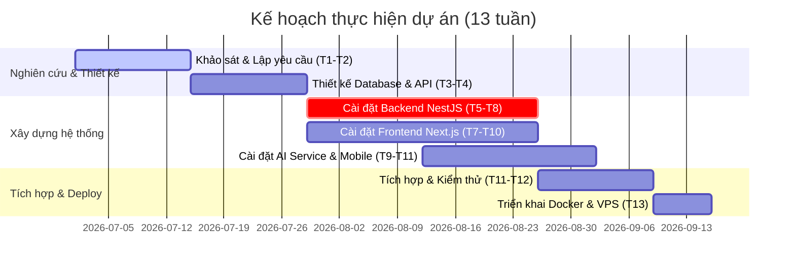

# TỔNG QUAN DỰ ÁN ĐỒ ÁN BẢO VỆ

---

## 1. Tên dự án
* **Tên:** Nền tảng Thương mại Điện tử Đa Nhà Bán (Multi-Vendor E-Commerce Platform).
* **Mục tiêu cốt lõi:** Xây dựng hệ thống sàn thương mại điện tử hoàn chỉnh cho phép nhiều shop cùng hoạt động độc lập, quản lý phân quyền chặt chẽ, tích hợp AI tư vấn sản phẩm, gợi ý sản phẩm cá nhân hóa, ứng dụng di động cho shipper.

---

## 2. Danh sách tính năng theo vai trò

Hệ thống phục vụ 4 nhóm người dùng chính:

### 2.1 Khách hàng (Customer)
* **Mua sắm & Duyệt tin:** Duyệt, tìm kiếm thông minh, lọc (theo giá, danh mục, đánh giá) và phân loại sản phẩm.
* **Giỏ hàng (Redis-backed):** Thêm, xóa, cập nhật số lượng sản phẩm cực nhanh O(1) trên Redis cache.
* **Tách đơn tự động (Order Splitting):** Tự động chia tách đơn hàng tổng thành các đơn con theo từng shop tương ứng khi mua sản phẩm từ nhiều shop khác nhau trong một phiên thanh toán.
* **Khuyến mãi (Coupon):** Áp dụng mã giảm giá toàn sàn (từ Admin) hoặc mã giảm giá riêng của từng shop.
* **Thanh toán tự động (SePay Integration):** Hỗ trợ thanh toán chuyển khoản ngân hàng qua mã QR động tự động kiểm tra trạng thái khớp tiền.
* **Theo dõi hành trình:** Xem trạng thái giao nhận và lộ trình của shipper trên bản đồ thời gian thực.
* **Tư vấn AI:** Chat trực tuyến với shop, tự động nhận phản hồi thông minh từ **AI Chatbot** am hiểu ngữ cảnh sản phẩm của shop.
* **Hệ thống gợi ý (Recommendation):** Gợi ý 16 sản phẩm cá nhân hóa dựa trên hành vi trước đó (Xem = 1, Thêm giỏ = 5, Đã mua = 8) kết hợp độ trễ thời gian (Recency Decay).
* **Đánh giá (Review):** Đánh giá sản phẩm kèm bình luận và số sao sau khi mua hàng thành công.

### 2.2 Nhà bán (Vendor)
* **Đăng ký shop:** Gửi yêu cầu đăng ký mở gian hàng mới trên sàn.
* **Quản lý cửa hàng:** Cấu hình thông tin shop, cập nhật logo, tên shop và mô tả.
* **Quản lý sản phẩm:** Đăng bán sản phẩm mới, upload nhiều hình ảnh, quản lý tồn kho và sửa/xóa sản phẩm.
* **Quản lý đơn hàng:** Xem và xử lý đơn hàng con độc lập của shop mình (chuẩn bị hàng, giao hàng cho shipper).
* **Quản lý khuyến mãi:** Tạo mã coupon giảm giá riêng dành cho khách mua hàng tại shop.
* **CSKH:** Nhắn tin trực tiếp với khách hàng để giải đáp thắc mắc.

### 2.3 Người giao hàng (Shipper)
* **Đăng nhập & xem đơn:** Xem danh sách các đơn hàng đang cần giao gần vị trí hiện tại.
* **Nhận đơn (Claim Order):** Quét mã QR/mã vạch kiện hàng thực tế để liên kết đơn với tài khoản shipper đó.
* **Cập nhật tiến độ:** Cập nhật các trạng thái đơn hàng (Tại bưu cục, Đang giao, Đã giao).
* **POD (Proof of Delivery):** Chụp ảnh thực tế gói hàng tại điểm giao để làm bằng chứng giao hàng thành công.
* **GPS Realtime Tracking:** Tự động phát tọa độ GPS từ chip điện thoại lên Redis qua Socket.io để khách hàng theo dõi trực tiếp.

### 2.4 Quản trị viên (Admin)
* **Quản trị thành viên:** Quản lý tài khoản, thực hiện ban/unban người dùng vi phạm.
* **Kiểm duyệt gian hàng:** Xem xét và phê duyệt hoặc từ chối các yêu cầu đăng ký mở shop của Vendor.
* **Quản lý danh mục:** Quản trị cấu trúc cây danh mục sản phẩm đa cấp (Self-referencing Category Tree).
* **Quản lý mã giảm giá:** Tạo mã giảm giá toàn sàn áp dụng cho tất cả các shop.
* **Báo cáo thống kê:** Thống kê doanh thu, số lượng đơn hàng, số lượng shop mới để đánh giá hiệu suất sàn.

---

## 3. Công nghệ sử dụng

Hệ thống được thiết kế theo mô hình **Multi-tier kết hợp lightweight microservice**:

| Tầng công nghệ | Tên công nghệ | Vai trò / Lý do sử dụng |
|---|---|---|
| **Frontend Web** | Next.js 15 (App Router) | Render phía máy chủ (SSR), tối ưu SEO, giao diện quản lý Admin/Vendor & Client đồng bộ. |
| **State Management** | Zustand | Thư viện quản lý state nhỏ gọn (~1KB), lưu trạng thái giỏ hàng và auth. |
| **Mobile App (Shipper)** | React Native (Expo SDK 54) | Ứng dụng di động đa nền tảng, tích hợp `expo-location` lấy GPS và `expo-camera` quét QR. |
| **Backend Core** | NestJS (TypeScript) | Kiến trúc Module/Service sạch sẽ, type-safety, tích hợp tốt với các giao thức Microservices. |
| **Database ORM** | Prisma ORM | Quản lý schema database tập trung, tự động migrate dữ liệu, hỗ trợ type-safe client. |
| **Database chính** | PostgreSQL | Cơ sở dữ liệu quan hệ mạnh mẽ, hỗ trợ lưu trữ UUID, kiểu mảng và JSONB. |
| **Caching & Fast Data** | Redis | Caching tốc độ cao O(1) cho giỏ hàng và lưu danh sách đen (Blacklist) của JWT token. |
| **Message Broker** | RabbitMQ | Hàng đợi tin nhắn xử lý đặt hàng bất đồng bộ, tránh nghẽn luồng và HTTP timeout. |
| **Realtime Gateway** | Socket.IO (WebSockets) | Truyền tin nhắn chat, gửi tọa độ GPS và thông báo đơn hàng realtime. |
| **AI Router Service** | FastAPI (Python) | Microservice độc lập xử lý chat bot bằng ngôn ngữ Python để tận dụng thư viện AI phong phú. |
| **Mô hình AI** | DeepSeek API | Mô hình ngôn ngữ lớn (LLM) giá rẻ, hỗ trợ tiếng Việt tốt để trả lời tư vấn cho khách. |
| **Thanh toán** | SePay Integration | Tự động hóa quét mã QR thanh toán ngân hàng tại Việt Nam (không qua trung gian đắt đỏ). |
| **Bản đồ** | Leaflet / OpenStreetMap | Hiển thị lộ trình giao hàng trực quan, miễn phí và không cần API key Google Maps. |
| **Hạ tầng triển khai** | Docker & Docker Compose | Container hóa toàn bộ 7 services để triển khai nhất quán và nhanh chóng trên VPS. |

---

## 4. Kế hoạch thực hiện dự án (13 tuần)

Dự án được thực hiện theo phương pháp phát triển lặp dạng **Agile-inspired**:

* **Tuần 1–2: Nghiên cứu & Thiết kế:** Khảo sát nghiệp vụ TMĐT, xác định yêu cầu chức năng, lựa chọn stack công nghệ, thiết kế database schema (Prisma), đặc tả endpoints API, mô hình hoá kiến trúc hệ thống.
* **Tuần 3–5: Cài đặt Backend:** Xây dựng lõi API với NestJS, tích hợp Prisma, Redis và RabbitMQ.
* **Tuần 6–8: Cài đặt Frontend:** Viết giao diện Next.js cho khách hàng, vendor, admin; quản lý state bằng Zustand.
* **Tuần 7–10: Cài đặt AI Service & Mobile:** Xây dựng chatbot FastAPI + DeepSeek và ứng dụng di động cho shipper bằng React Native Expo.
* **Tuần 11–12: Tích hợp & Kiểm thử,Triển khai Production** Kiểm thử tích hợp toàn bộ hệ thống, kiểm tra xử lý race condition hết hàng, tối ưu hóa database.Đóng gói Docker Compose, cấu hình Nginx Reverse Proxy, cài Let's Encrypt SSL và chạy trên VPS thực tế.
